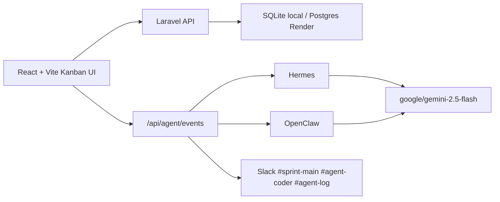

# Architecture

## Overview

The system is a split Laravel API and React client.

## Backend

Laravel owns persistence and API validation.

- `Board` has many `Task` records.
- `Task` belongs to `Board`.
- Task statuses are constrained to `todo`, `in_progress`, and `done`.
- Feature tests cover CRUD, task movement, validation, and agent event acceptance.

## Frontend

React owns the Kanban interaction model.

- `Navbar` shows agent sync state and refresh.
- `Board` surface contains the three workflow columns.
- `Column` is a droppable status lane.
- `TaskCard` is draggable and editable.
- `TaskModal` creates and edits tasks.

Drag-and-drop is powered by `@dnd-kit`. Icons use `lucide-react`.

## Agent Integration

The app does not reconfigure Slack, Hermes, OpenClaw, or Gemini. It emits workflow events to the existing layer through `POST /api/agent/events`.

Payloads include:

- event name, such as `task.moved`
- task id/title/status
- board id/name
- human-readable message
- model marker: `google/gemini-2.5-flash`
- Slack channels: `sprint-main`, `agent-coder`, `agent-log`

If webhook URLs are absent, the backend logs the event and returns a successful queued response so local product use is not blocked by agent credentials.
